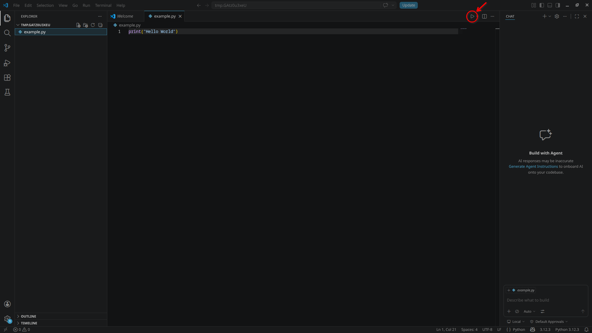

# Conceptos básicos de Python
>[!Important]
> Estas prácticas asumen que tienes acceso al CESGA y que tienes activada la conexión VPN. Si no es así, por favor, sigue las instrucciones que se facilitan [aquí](./data/text/install-cesga-vpn.md). También se asume que tiene Visual Studio Code instalado.

>[!Tip]
> Si tienes `pip` instalado, puedes usar `ipython` para ejecutar pruebas rápidas de código. Instala `ipython` ejecutando: `pip install ipython` en la terminal / Power Shell. Luego, escribe `ipython` en la terminal/Power Shell para iniciar el intérprete interactivo de Python. Para salir, escribe `exit()` o presiona `Ctrl + D`.

Python es un lenguaje de programación de alto nivel, interpretado y de propósito general. Es conocido por su sintaxis clara y legible, lo que lo hace ideal como primer lenguaje de programación. En estas prácticas aprenderemos a utilizar Python como una calculadora avanzada, a evaluar condiciones y a usar bucles para repetir tareas. Estas son habilidades fundamentales que te permitirán resolver una amplia variedad de problemas computacionales.

# Índice
- [Conceptos básicos de Python](#conceptos-básicos-de-python)
- [Índice](#índice)
- [Preparación del entorno de trabajo](#preparación-del-entorno-de-trabajo)
- [Práctica 1: Variables y tipos de datos](#práctica-1-variables-y-tipos-de-datos)
  - [Ejercicios](#ejercicios)
    - [Ejercicio 1](#ejercicio-1)
    - [Ejercicio 2](#ejercicio-2)
    - [Ejercicio 3](#ejercicio-3)
      - [3.1](#31)
      - [3.2](#32)
- [Práctica 2: Condicionales](#práctica-2-condicionales)
  - [2.1. Evaluación de condiciones](#21-evaluación-de-condiciones)
  - [2.2. Estructuras de control condicionales](#22-estructuras-de-control-condicionales)
  - [Ejercicios](#ejercicios-1)
    - [Ejercicio 1](#ejercicio-1-1)
    - [Ejercicio 2](#ejercicio-2-1)
    - [Ejercicio 3 *(extra)*](#ejercicio-3-extra)
- [Práctica 3: Bucles](#práctica-3-bucles)
  - [3.1. Bucle `for`](#31-bucle-for)
  - [3.2. Bucle `while`](#32-bucle-while)
  - [Ejercicios](#ejercicios-2)
    - [Ejercicio 1](#ejercicio-1-2)
    - [Ejercicio 2](#ejercicio-2-2)
    - [Ejercicio 3 *(extra)*](#ejercicio-3-extra-1)

# Preparación del entorno de trabajo
A lo largo de las prácticas se pedirá que pruebes fragmentos de código y que realices ejercicios. Para ello, crea un directorio temporal y abrelo con Visual Studio Code. A medida que las prácticas avancen, crea tantos archivos `.py` en ese directorio como consideres necesario. El objetivo es realizar pruebas rápidas, por lo que no es necesario crear un proyecto formal ni una estructura de archivos organizada.

La primera vez que abras un archivo `.py` en Visual Studio Code, te preguntará si quieres instalar la extensión de Python. Acepta la instalación. Luego, para ejecutar el código, simplemente pulsa sobre el botón con el símbolo de "play" rodeado en la siguiente imagen:



Se debería abrir una terminal y mostrar el resultado de la ejecución.

Si lo prefieres, puedes usar directamente `ipython`, pero no se guardarán los fragmentos de código que ejecutes.

# Práctica 1: Variables y tipos de datos
En Python, puedes declarar una variable simplemente asignándole un valor. No es necesario especificar el tipo de dato, ya que Python lo infiere automáticamente. Aquí tienes algunos ejemplos:

```python
# Declaración de variables
x = 10          # Entero
y = 3.14        # Flotante
name = "Alice"  # Cadena de texto
is_active = True # Booleano 
```

Para realizar operaciones básicas con variables, puedes usar los operadores aritméticos:

```python
x = 10
y = 3.14

# Operaciones aritméticas
addition = x + y      # Suma
difference = x - y # Resta
product = x * y   # Multiplicación
quotient = x / y  # División
power = x ** 2    # Potencia
```

Para realizar operaciones más avanzadas se puede usar la biblioteca `math`. Solo es necesario importarla una vez al principio del código:

```python
import math
```

A partir de ahí, se pueden usar las siguientes funciones y constantes matemáticas (entre otras):

```python
import math

# Operaciones avanzadas
sqrt = math.sqrt(x)    # Raíz cuadrada
sin_x = math.sin(x)    # Seno de x
cos_x = math.cos(x)    # Coseno de x
tan_x = math.tan(x)    # Tangente de x

# Constantes matemáticas
pi = math.pi           # Pi
e = math.e             # Número de Euler
```

Combinando la declaración de variables y las operaciones, puedes realizar cálculos complejos y manipular datos de diversas maneras. Copia manualmente el siguiente código y ejecútalo:

```python
a = 5
b = 2
addition = a + b
subtraction = a - b
multiplication = a * b
division = a / b

print("Suma:", addition)
print("Resta:", subtraction)
print("Multiplicación:", multiplication)
print("División:", division)
```

Fíjate cómo los valores asignados a las variables `a` y `b` se sustituyen en las operaciones siguientes, y los resultados se almacenan en nuevas variables (addition, subtraction...). Estas nuevas variables, a su vez, se pueden usar en otras operaciones. Se usa la función `print()` para mostrar resultados en la consola.

Aquí otro ejemplo:

```python
x = 0.75
e = math.sin(x)**2 + math.cos(x)**2
print(e)
```

Por último, para redondear podemos usar la función `round()`, que toma dos argumentos: el número a redondear y el número de decimales del redondeo. Si no se especifica el número de decimales, se redondeará al entero más cercano. Por ejemplo:
```python
number = 10/3

rounded = round(number)
rounded_two_decimals = round(number, 2)

print(rounded)  # Output: 3
print(rounded_two_decimals)  # Output: 3.33
```

## Ejercicios
### Ejercicio 1
Sea la siguiente identidad trigonométrica:
$$
cos^2\frac{x}{2} = \frac{\tan{x} + \sin{x}}{2\sin{x}}
$$
Verifica que esta identidad es cierta calculando ambos miembros de la ecuación, sustituyendo $x$ por $x = \frac{\pi}{5}$.

<details>
<summary style="text-align: right;">Ver respuesta</summary>

```python
import math

x = math.pi / 5

left_side = math.cos(x / 2) ** 2
right_side = (math.tan(x) + math.sin(x)) / (2 * math.sin(x))

print("Lado izquierdo:", left_side)
print("Lado derecho:", right_side)
```
</details>

### Ejercicio 2
Un objeto con una temperatura inicial $T_0$ se introduce en el instante $t=0$  dentro de una cámara que tiene una temperatura constante $T_S$. Entonces, el objeto experimenta un cambio de temperatura que se corresponde con la ecuación de enfriamiento de Newton:
$$
T = T_S + (T_0 - T_s) e^{-kt}
$$
donde $T$ es la temperatura del objeto en el instante $t$, y $k$ es una constante de enfriamiento.

Una lata de refresco, con una temperatura de 48°C se introduce en un refrigerador que tiene en su interior una temperatura de 3°C. Calcula, redondeando el resultado a dos decimales, la temperatura de la lata después de tres horas. Considera k = 0.45.

Primero deben definirse todas las variables y seguidamente se calculará la temperatura usando un solo comando.

<details>
<summary style="text-align: right;">Ver respuesta</summary>

```python
T0 = 48
Ts = 3
k = 0.45
t = 3

T = round(Ts + (T0 - Ts) ** (-k * t), 2)
```
</details>

### Ejercicio 3
Resuelve los siguientes problemas:
#### 3.1
$$
\frac{35.7 \cdot 64 - 7^3}{45+5^2}
$$

#### 3.2
$$
\frac{5}{4} \cdot 7 \cdot 6^2 + \frac{3^7}{(9^3 - 652)}
$$


# Práctica 2: Condicionales
## 2.1. Evaluación de condiciones
Una de las características más destacables de los lenguajes de programación es la capacidad de evaluar condiciones y responder ante ellas de una u otra forma según su resultado. La evaluación de una condición solo puede dar como resultado dos valores: verdadero (True) o falso (False). Para evaluar condiciones se pueden emplear los siguientes operadores de comparación:

| Operador | Significado         |
|----------|---------------------|
| `==`     | Igual a             |
| `!=`     | Distinto de         |
| `<`      | Menor que           |
| `>`      | Mayor que           |
| `<=`     | Menor o igual que   |
| `>=`     | Mayor o igual que   |

Para agrupar varias condiciones se pueden usar los operadores:

| Operador | Significado     |
|----------|-----------------|
| `and`    | Y lógico        |
| `or`     | O lógico        |
| `not`    | Negación lógica |

Por ejemplo, ejecuta:
```python
age = 20
is_adult = age >= 18
print("Is the person an adult?: ", is_adult)
```
Prueba a modificar la edad y vuelve a ejecutarlo.

Otro ejemplo:
```python
income = 1000
expenses = 800

savings = income - expenses
is_saving = savings > 0
is_rich = income > 2000

print("Is the person saving money?: ", is_saving)
print("Is the person rich?: ", is_rich)
print("Is the person saving money and rich?: ", is_saving and is_rich)
```

## 2.2. Estructuras de control condicionales
Hasta ahora nos hemos limitado a almacenar el resultado de evaluar una condición en una variable, sin embargo Python proporciona un mecanismo para responder de forma dinámica a la evaluación de condiciones: las estructuras de control condicionales. Estas estructuras permiten dirigir el flujo de ejecución de un programa, ejecutando ciertos bloques de código solo si se cumplen determinadas condiciones.

Para evaluar condiciones se usa el operador `if`, este ejecutará el código indentado que le sigue, solo si la condición que se le ha asignado es verdadera. Por ejemplo, ejecuta:

```python
x = 10
if x > 5:
    print("x es mayor que 5")
```

Como la condición `x > 5` es verdadera, se ejecutará el bloque de código dentro del `if`. Observa como las líneas afectadas por el `if` están indentadas (con sangría). En Python, la indentación es crucial para definir la lógica del programa. Para añadir una sangría, puedes usar la tecla Tab o cuatro espacios.

La estructura básica de un bloque `if` es la siguiente:

```
if <condición>:
    <código a ejecutar si la condición es verdadera>
```

Para añadir condiciones adicionales se pueden usar los operadores `elif` (else if) y `else`. Por ejemplo:

```python
x = 10
if x > 15:
    print("x es mayor que 15")
elif x > 5:
    print("x es mayor que 5 pero no mayor que 15")
else:
    print("x es menor o igual que 5")
```

En este caso, primero se evalúa la condición `x > 15`; como es falsa, se pasa a la siguiente condición `x > 5`, que es verdadera, por lo que se ejecutará su bloque de código. En caso de que ambas condiciones fueran falsas, se ejecutaría el bloque de código dentro del `else`. Prueba a ejecutar el código anterior cambiando el valor de `x` para ver cómo varía la salida.

Por último, es posible agrupar varias condiciones usando los operadores lógicos `and`, `or` y `not`. Por ejemplo:

```python
x = 10
y = 5
if x > 5 and y < 10:
    print("x es mayor que 5 y y es menor que 10")
```

Lo más común es almacenar primero el resultado de las evaluaciones en variables booleanas y luego usarlas en el `if`. Por ejemplo: 

```python
age = 20
is_adult = age >= 18
if is_adult:
    print("Puedes pasar")
else:
    print("No puedes pasar")
```

## Ejercicios
### Ejercicio 1
Para solicitar una entrada al usuario, se puede usar la función `input()`. Por ejemplo:

```python
name = input("¿Cuál es tu nombre? ")
print("Hola, " + name)
```
Durante la ejecución, el programa se detendrá en la primera línea, imprimirá por la terminal el mensaje "¿Cuál es tu nombre? " y esperará a que el usuario introduzca su nombre. Una vez el usuario pulse Enter, la variable "name" almacenará la respuesta del usuario.

Teniendo esto en cuenta, escribe un programa que:
1. Solicite al usuario su edad
2. Le muestre el siguiente mensaje: 
    > "¿Qué película quieres ver? (1) Acción, (2) Comedia, (3) Terror"
1. Si el usuario elige la opción 3 y su edad es menor de 18 años, se muestra un mensaje: "No puedes ver esa película"
2. En caso contrario, se muestra un mensaje: "Que disfrutes de la película".

### Ejercicio 2
Escribe un programa que solicite al usuario dos números y un operador matemático (puede ser +, -, *, /) y realice la operación correspondiente con los números introducidos. Si el usuario introduce un operador no válido, se mostrará un mensaje de error.

### Ejercicio 3 *(extra)*
La librería `random` proporciona una función llamada `choice()`, que selecciona un elemento al azar de una lista. Se usa así:

```python
import random
colors = ["rojo", "verde", "azul"]
random_color = random.choice(colors)
print(random_color)
```

Escribe un programa que simule una partida de piedra, papel o tijera entre el usuario y la computadora con las siguientes características:
1. El programa solicita al usuario que introduzca su elección (piedra, papel o tijera).
2. La computadora elige al azar entre las tres opciones.
3. El programa determina el ganador según las reglas del juego:
   - Piedra gana a tijera
   - Tijera gana a papel
   - Papel gana a piedra
4. El programa muestra el resultado de la partida (quién ha ganado o si ha sido un empate).

<details>
<summary style="text-align: right;">Ver respuesta</summary>

```python
import random

options = ["piedra", "papel", "tijera"]
user_choice = input("Elige piedra, papel o tijera: ")
computer_choice = random.choice(options)

user_win_1 = user_choice == "piedra" and computer_choice == "tijera"
user_win_2 = user_choice == "tijera" and computer_choice == "papel"
user_win_3 = user_choice == "papel" and computer_choice == "piedra"

if user_win_1 or user_win_2 or user_win_3:
    print("¡Has ganado!")
elif user_choice == computer_choice:
    print("¡Empate!")
else:
    print("¡Has perdido!")
```

</details>

# Práctica 3: Bucles
Los bucles son estructuras de control que permiten repetir un bloque de código varias veces. En Python, existen dos tipos principales de bucles: el bucle `for` y el bucle `while`. Los bucles están íntimamente ligados a los iteradores, que son "contenedores" de datos que se pueden recorrer elemento a elemento. Por ejemplo, las listas, tuplas y diccionarios son elementos iterables.

## 3.1. Bucle `for`
En esta práctica tres vamos a usar listas para demostrar el funcionamiento de los bucles. Por ejemplo, ejecuta y observa el comportamiento de esta pieza de código:

```python
fruits = ["manzana", "banana", "cereza"]
for fruit in fruits:
    print("Nombre de la fruta:", fruit)
```

Acabamos de aplicar la línea de código `print("Nombre de la fruta:", fruit)` a cada elemento de la lista `fruits`, hemos "recorrido" la lista. A cada una de las veces que un bucle ejecuta su código se le denomina "iteración". En cada iteración de este bucle `for`, la variable `fruit` toma el valor de un elemento de la lista; empezando desde el primer elemento en la primera iteración, hasta el último elemento en la última iteración.

La estructura básica de un bucle `for` es la siguiente:

```
for <nombre de variable temporal> in <iterable>:
    <código a ejecutar en cada iteración>
```

La variable temporal irá tomando los valores de cada elemento del iterable en cada iteración.

Cuando queremos recorrer un rango de valores, podemos usar la función `range()`. Por ejemplo:

```python
for i in range(5):
    print(i)

## Output:
0
1
2
3
4
```

Esto es equivalente a escribir:

```python
sequence = [0, 1, 2, 3, 4] # La función range(5) genera esta secuencia de números
for i in sequence:
    print(i)
```

La función `range(n)` genera una secuencia de números enteros desde 0 hasta n-1. Si quieres generar una secuencia que empiece en un número diferente a 0, puedes usar `range(start, stop)`, donde `start` es el número inicial y `stop` es el número final (exclusivo). Por ejemplo, `range(2, 7)` generará la secuencia 2, 3, 4, 5, 6.

> [!Note]
> Observa que el número 5 no se incluye en la secuencia generada por `range(5)`. Python usa un **sistema de indexación basado en cero**, lo que significa que el primer elemento de una secuencia se le asigna el índice 0. Esto también se aplica a las listas, tuplas y diccionarios.

## 3.2. Bucle `while`
El bucle `while` no depende de un iterable, sino que se ejecuta mientras una condición sea verdadera. La condición se evalúa **antes de cada iteración**, y si es falsa, el bucle se detiene. Por ejemplo:

```python
count = 0
while count < 5:
    print(count)
    count += 1
```

Este bucle `while` suma 1 a la variable `count`, y se detendrá en cuanto esta sea igual a 5.

## Ejercicios
### Ejercicio 1
Escribe un programa que solicite al usuario un número entero positivo y luego imprima un saludo ese número de veces. Por ejemplo, si el usuario introduce el número 3, el programa debería imprimir "¡Hola!" tres veces.

### Ejercicio 2
Escribe un programa que solicite al usuario un número entero positivo y luego imprima una cuenta regresiva desde ese número hasta 0.

### Ejercicio 3 *(extra)*
Escribe un programa que solicite al usuario un número entero positivo y luego imprima la tabla de multiplicar de ese número desde 1 hasta 10. Por ejemplo, si el usuario introduce el número 5, el programa debería imprimir:
```
5 x 1 = 5
5 x 2 = 10
5 x 3 = 15
...
5 x 10 = 50
```

<details>
<summary style="text-align: right;">Ver respuesta</summary>

```python
number = int(input("Introduce un número entero positivo: "))
for i in range(1, 11):
    result = number * i
    print(f"{number} x {i} = {result}")
```

</details>